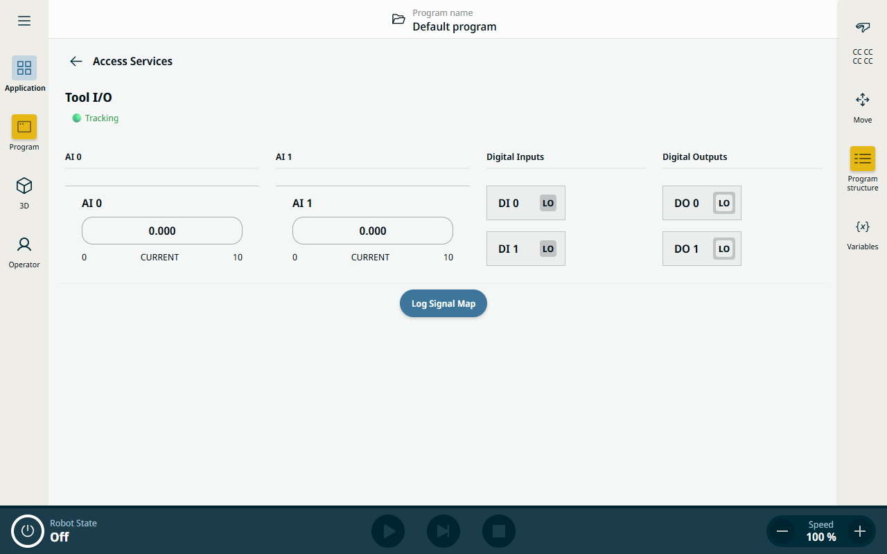

# Accessing Services - URCap Web Contribution

This project is an Angular-based URCap Web Contribution that demonstrates how to access and monitor Universal Robots' Tool I/O signals in real-time. The application provides a comprehensive interface for viewing analog inputs (AI), digital inputs (DI), and digital outputs (DO) from the robot's tool interface.

## What it does

The **Accessing Services** URCap provides a real-time monitoring dashboard for Universal Robots' Tool I/O signals. It displays:

- **Analog Inputs (AI 0, AI 1)**: Shows voltage/current values with proper scaling and domain information
- **Digital Inputs (DI 0, DI 1)**: Displays boolean on/off states
- **Digital Outputs (DO 0, DO 1)**: Shows boolean on/off states for outputs

## How it works

### Architecture
- **Framework**: Angular 19 with TypeScript
- **UI Components**: Uses Universal Robots' UI Angular Components library
- **Signal Processing**: Implements real-time signal monitoring via the Contribution API
- **State Management**: Utilizes Angular Signals for reactive state management

### Key Components

#### AccessServicesComponent
The main component that:
- Implements the `ApplicationPresenter` interface for URCap integration
- Manages real-time signal subscriptions through the `sourceService`
- Organizes signals into computed properties for display
- Handles different signal types (boolean, float, analog domain)

#### Signal Processing
- **Real-time Updates**: Subscribes to `ur-robot-io` and `ur-tool-io` source updates
- **Signal Filtering**: Intelligently filters signal types based on I/O type (digital vs analog)
- **Value Processing**: Converts raw signal events into displayable values
- **State Tracking**: Maintains a reactive map of all signal states

#### UI Features
- **Status Indicator**: Shows connection status (🟢 Tracking / 🔴 Not Tracking)
- **Responsive Grid**: 4-column layout that adapts to screen size
- **UR Components**: Uses specialized UR components for signal display:
  - `ur-analog-signal-display` for analog inputs
  - `ur-digital-signal-display` for digital I/O
  - `ur-card` for fallback display

### Signal Types Handled
- `signal_boolean_value`: For digital inputs/outputs
- `signal_float_value`: For analog input values
- `signal_analog_domain`: For analog input domain information (voltage/current)

### Installation
To install the contribution type:

`$ npm install`

### Build
To build the contribution type:

`$ npm run build`

### Deploy
To deploy the contribution to the simulator type:

`$ npm run install-urcap`

## Further help

Get more help from the included SDK documentation.
